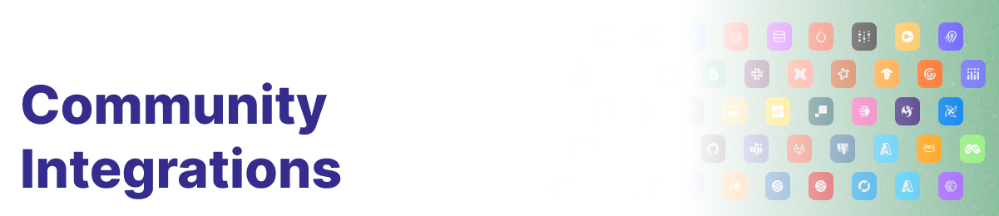

    

---

Community built and maintained integrations in the Dagster ecosystem.

## Contributing

See [CONTRIBUTING.md](CONTRIBUTING.md).

## Releases

See [RELEASES.md](RELEASES.md).

## Community

We are very appreciative of the work from our community members, and would like to recognize:

* [GingerYouth](https://github.com/GingerYouth) for their work on the Java Pipes implementation
* [marijncv](https://github.com/marijncv) for their work on the Rust Pipes implementation
* [christeefy](https://github.com/christeefy) for their work on the Rust Pipes implementation
* [JasperHG90](https://github.com/JasperHG90) for their work on the Iceberg integration
* [danielgafni](https://github.com/danielgafni) for their work on the Polars integration

Thank you all!

  

---

    Made with  by the Dagster community.

